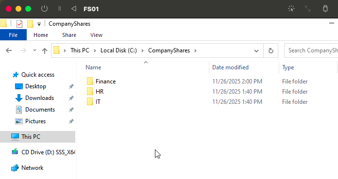
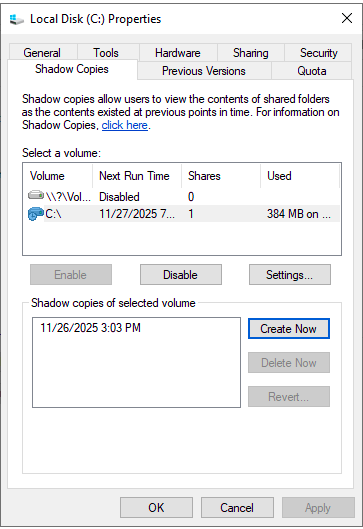
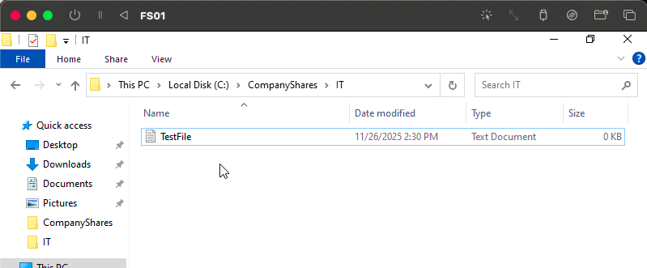
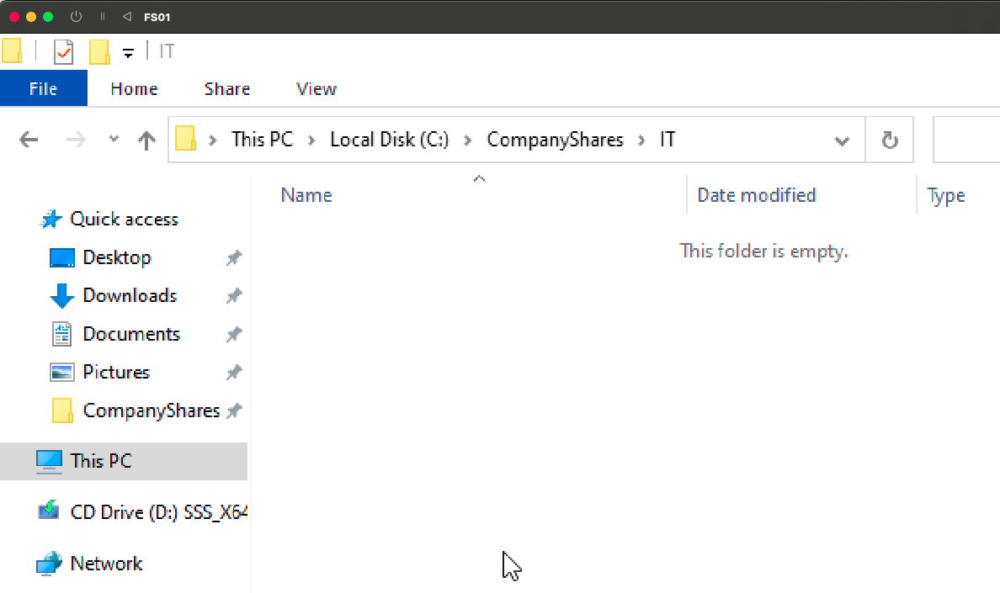
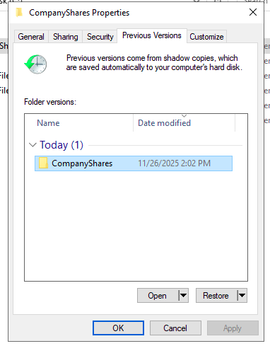
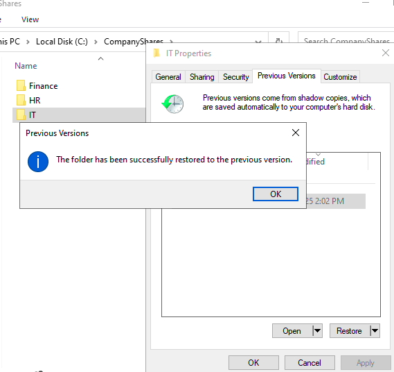
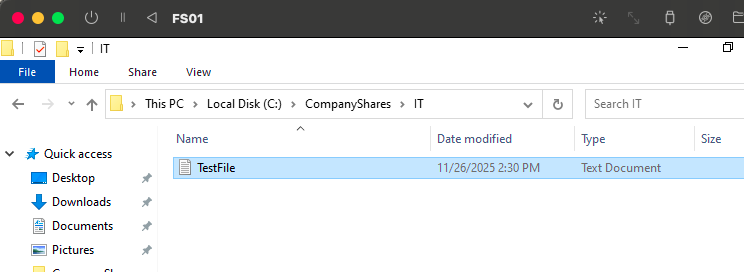

# 🗂️ Lab 6 — Shadow Copies & File Restore  
This lab demonstrates how to enable Shadow Copies on FS01, delete a file, and restore it using Previous Versions.

---

## 📁 Folder Structure  
screenshots/
FS01-01-companyshares-folders.png
FS01-02-shadowcopies-enabled.png
FS01-03-create-testfile.png
FS01-04-delete-testfile.png
FS01-05-previous-versions-window.png
FS01-06-restore-confirmation.png
FS01-07-restored-file-verification.png

yaml
Copy code

---

# ✅ **Step 1 — Verify Folder Structure**

On **FS01**, open File Explorer and navigate to:

C:\CompanyShares

yaml
Copy code

You should see the subfolders **Finance**, **HR**, and **IT**.

**Screenshot:**  

---

# ✅ **Step 2 — Enable Shadow Copies**

1. Right-click **Local Disk (C:)** → **Properties**  
2. Go to the **Shadow Copies** tab  
3. Select **C:\\**  
4. Click **Enable**  
5. (Optional) Configure **Storage Size** and **Schedule**

**Screenshot:**  

---

# ✅ **Step 3 — Create Test File**

Navigate to:

C:\CompanyShares\IT

sql
Copy code

Create a new file named:

TestFile.txt

yaml
Copy code

**Screenshot:**  

---

# ✅ **Step 4 — Delete the Test File**

Delete **TestFile.txt** from the IT folder.

**Screenshot:**  

---

# ✅ **Step 5 — Open Previous Versions**

1. Right-click **IT folder** → **Properties**  
2. Go to **Previous Versions**  
3. Select a shadow copy made *before the file was deleted*

**Screenshot:**  

---

# ✅ **Step 6 — Restore the Folder**

Click **Restore** → Confirm the restoration.

**Screenshot:**  

---

# ✅ **Step 7 — Verify Restoration**

Return to:

C:\CompanyShares\IT

yaml
Copy code

Confirm **TestFile.txt** is restored.

**Screenshot:**  

---

# 🎉 **Lab Complete**

You successfully:

✔ Enabled Shadow Copies  
✔ Created a file  
✔ Deleted it  
✔ Restored it using Previous Versions  
✔ Verified the restored data  

This demonstrates real-world file recovery for shared folders in Windows Server environments.